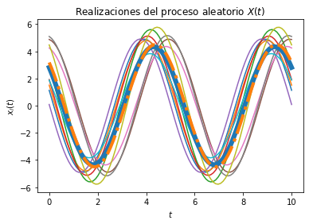
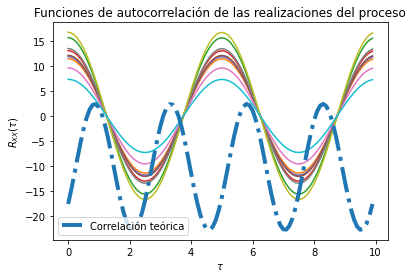

# Laboratorio 4

Integrantes:\
Luis Javier Herrera Barrantes B93840\
Gabriel Angulo Sibaja B90457

Las librerías a utilizar en el presente laboratorio van a ser las siguientes:
```py
import numpy as np
from scipy import stats
import matplotlib.pyplot as plt

```
Se procede a crear las variables aleatroias C y Z necesarias
```py
vaC = stats.norm(5, np.sqrt(0.2))
vaZ = stats.uniform(0, np.pi/2)

```
El parámetro omega se va a crear utilizando el valor medio del rango original [2pi(59.1), 2pi(60.1)]
```py
omega = 2*np.pi*59.6
```
Se debe crear un vector de tiempo
```py
T = 100			# número de elementos
t_final = 10	# tiempo en segundos
t = np.linspace(0, t_final, T)
```
Se da la inicialización del proceso aleatorio con N realizaciones
```py
N = 10
X_t = np.empty((N, len(t)))	# N funciones del tiempo x(t) con T puntos
```
Creación de un for loop para las muestras del proceso x(t) siendo las variables C y Z independientes
```py
for i in range(N):
	C = vaC.rvs()
	Z = vaZ.rvs()
	x_t = C * np.cos(omega*t + Z)
	X_t[i,:] = x_t
	plt.plot(t, x_t)
```
Cálculo del promedio de las N realizaciones para cada instante de tiempo 
```py
P = [np.mean(X_t[:,i]) for i in range(len(t))]
plt.plot(t, P, lw=6)
```
Se grafica el resultado teórico del valor esperado utilizando omega
```py
E = 10/np.pi* (np.cos(omega*t) - np.sin(omega*t))
plt.plot(t, E, '-.', lw=4)
```

Se muestras las realizaciones con su promedio teórico y calculado
```py
plt.title('Realizaciones del proceso aleatorio $X(t)$')
plt.xlabel('$t$')
plt.ylabel('$x_i(t)$')
plt.show()
```
Valores de desplazamiento y constante tau
```py
desplazamiento = np.arange(T)
taus = desplazamiento/t_final
```
Se crea la matriz de correlaciones para las N funciones y se grafica para la autocorrelación
```py
corr = np.empty((N, len(desplazamiento)))
plt.figure()
```
Se realiza el cálculo de correlación para cada valor de tau utilizando un for loop
```py
for n in range(N):
	for i, tau in enumerate(desplazamiento):
		corr[n, i] = np.correlate(X_t[n,:], np.roll(X_t[n,:], tau))/T
	plt.plot(taus, corr[n,:])

```
Creación de la variable aletoria theta la cual se toma como constante.\
El valor que se elige para el parámetro es el valor medio del rango original [0, pi/2]
```py
Theta = np.pi/4

```

Calculo del valor teórico de la correlación
```py
Rxx = 25.2 * np.cos(omega*t+Theta) * np.cos(omega*(t+tau)+Theta)
```

Se crean las gráficas de correlación para cada realización y sus funciones
```py
plt.plot(taus, Rxx, '-.', lw=4, label='Correlación teórica')
plt.title('Funciones de autocorrelación de las realizaciones del proceso')
plt.xlabel(r'$\tau$')
plt.ylabel(r'$R_{XX}(\tau)$')
plt.legend()
plt.show()
```
# Gráficas obtenidas en los resultados







